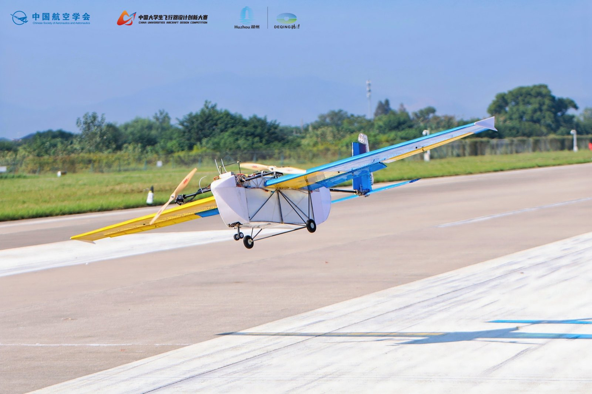
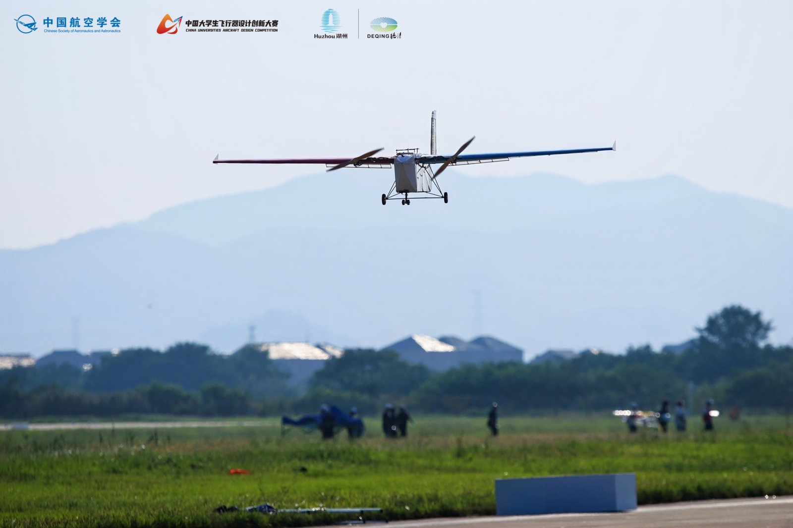

# 飞行器创新实验室

:::info

通常简称为**飞创**

:::

## 实验室简介

合肥工业大学宣城校区飞行器创新实验室成立于 2017 年，是宣城校区首个多学科交叉融合的实验室。实验室依托计算机与信息系，由欧阳一鸣和姜兆能老师悉心指导，围绕“创新驱动、实践导向”的核心理念，致力于培养具备程序设计、模型设计和动手实践能力的创造型人才。

实验室位于计算机中心楼 302B（机械组）、310（电控组）、311（电控组），配备大功率激光切割机、3D 打印机、四旋翼飞行器、大型及小型固定翼无人机等专业设备，为同学们的创新实践提供坚实的硬件支撑。

经过多年的积累，实验室拥有大量飞行器资料与飞行器模型制作经验，在这里你将有机会深入学习：C 语言控制程序编写、单片机与嵌入式开发、目标识别、3D 建模打印、材料制图、机械模型设计等前沿知识与技术。

## 荣誉与成就

自成立以来，实验室在各类国家级、省级科技创新竞赛中屡创佳绩：

- 🏆全国冠军：对地侦查与打击无人机项目全国冠军
- 🏆全国季军：机翼静载全国季军
- 🏆安徽省第一名：安徽省电子设计竞赛无人机赛道第一名

近年重点赛事成绩：

| 年份 | 比赛                                   | 奖项                                                                                       |
| ---- | -------------------------------------- | ------------------------------------------------------------------------------------------ |
| 2018 | 中国国际飞行器设计挑战赛               | 全国一等奖四项、二等奖两项、三等奖一项                                                     |
| 2023 | 中国大学生飞行器设计创新大赛东部赛区   | 三个项目分别获得第一名、第二名、第三名                                                     |
| 2023 | 中国大学生飞行器设计创新大赛全国总决赛 | 三个项目分别获得一等奖、二等奖、三等奖                                                     |
| 2024 | 中国大学生飞行器设计创新大赛东部赛区   | 三个项目二等奖                                                                             |
| 2024 | 中国大学生飞行器设计创新大赛全国总决赛 | 一等奖一项、二等奖一项、三等奖六项                                                         |
| 2024 | 安徽省大学生电子设计大赛无人机赛道     | 一等奖一项、二等奖一项、三等奖两项                                                         |
| 2025 | 中国大学生飞行器设计创新大赛全国总决赛 | 特等奖 2 项、二等奖 1 项、三等奖 3 项                                                      |
| 2025 | 安徽省电子设计创新大赛                 | 二等奖三项、三等奖五项                                                                     |
| 2026 | 中国大学生飞行器设计创新大赛东部赛区   | 太阳能任务飞行、限时载运飞行、无人机短距起降等多个项目一、二、三等奖，并成功入围全国总决赛 |
| 2026 | 安徽省大学生电子设计大赛               | 二等奖、三等奖共八项                                                                       |

## 招新

### 加入我们，你将获得

- 实战平台：每年组织参加中国大学生飞行器设计创新大赛、全国大学生电子设计竞赛、安徽省机器人大赛等多项高水平科技创新竞赛。
- 技术成长：从 C 语言编程、嵌入式开发到飞行器设计、3D 建模打印，全方位培养你的工程实践能力。
- 团队协作：与来自不同专业的同学并肩作战，在真实项目中锻炼团队协作与问题解决能力。
- 荣誉加身：在国家级赛事中为校争光，为自己的履历增添耀眼的一笔，大疆等企业特设 CUADC 招聘通道。

### 招新对象与要求

:::tabs

== 2026 级同学（新大一）

大一新同学不论基础，只要你对飞行器设计与科技创新充满热情，都欢迎加入！

实验室设有两大方向：

- 电控组：学习 C 语言程序编写、单片机与嵌入式开发、图像处理（目标识别）、飞行器控制等
- 机械组：学习 SW、Catia 3D 建模、CAD 平面制图、XFLR5、Profili 等飞行器设计软件，以及 ANSYS 软件分析，同时直接参与 3D 打印、激光切割、飞行器模型制作的实践

== 2025 级同学（大二）

仅招收掌握以下相关能力之一的大二同学，看到招新通知后可以直接联系管理员参加面试考核。

1. 对 51/32 单片机能够熟练掌握运用，且经过项目实践
2. 有固定翼飞行器设计能力和相关建模画图能力
3. 有手动飞行固定翼飞行器的经验，且能够熟练掌控

:::

### 招新流程

1. 加入招新群：2026 飞行器创新实验室招新群号 [1108684404](https://qm.qq.com/q/Sz8zJtnLaw)
2. 填写报名表：关注群内发布的在线报名表信息，及时填写
3. 笔试考核：暂定于十月中旬进行第一轮笔试，笔试学习资料发布在群文件
   - 电控组：重点考察 C 语言部分
   - 机械组：笔试学习资料 1-15 页
4. 集中培训与面试：笔试通过后开展数月的集中培训，每次培训都将计入考核，通过最终面试即可加入实验室

## 了解更多

更多实验室日常训练视频可前往[哔哩哔哩](https://space.bilibili.com/678400296)、[抖音](https://www.douyin.com/user/MS4wLjABAAAAVPNXH4sMYV6H5d2bnB0DqFLlSL6Rz4lWZ7r9PBoGOIAiRReacQdUetU3y6KkA7lW)观看。

<iframe src="//player.bilibili.com/player.html?isOutside=true&aid=113038707394768&bvid=BV1KPsTeDEWR&cid=25662528841&p=1&autoplay=0" scrolling="no" border="0" frameborder="no" framespacing="0" allowfullscreen="true"></iframe>

让梦想起飞，从飞行器创新实验室开始！

我们期待每一个热爱蓝天、敢于创新的你加入这个大家庭，一起在无人机的轰鸣声中追逐科技梦想，在赛场上为合肥工业大学宣城校区书写新的辉煌！

